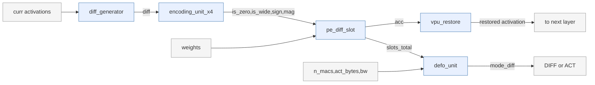

# Ditto Reproduction — Project Summary

**Paper:** *Ditto: Accelerating Diffusion Model via Temporal Value Similarity* (HPCA 2025, Yonsei)
**Scope:** Coding Test 5 — algorithm compilation/mapping + performance model + testing + extendability.
**Workload:** Stable Diffusion v1.4 UNet (CompVis) as primary; **DiT-XL/2 and Fast-dLLM v2 (7B text diffusion) as extension workloads** (Section 9); int8 activations, single-image (batch 1).
**Author:** njzhx213

This document is written to be **honest about what is reproduced, what is a modeling choice, and what is not done and why.** Every number is labeled paper-stated / inferred / swept. No parameter was tuned to hit a paper figure; where the model and the paper disagree, the disagreement is reported and explained rather than fitted away.

---

## 0. Headline results

| Quantity | Our result | Paper | Status |
|---|---|---|---|
| Temporal-diff bit-width, SDM (zero) | 45.9% | 44.48% | reproduced |
| Temporal-diff bit-width, DiT (zero, MAC-weighted) | 67.2% | — | measured (DiT trace) |
| Total MACs, SDM (incl. attention) | 401.6 G | ~340 G public (linear/conv only) | enumerated |
| Compute ceiling, SDM (incl. attention) | 8.89x | — (paper reports net 1.5x) | derived |
| Bare memory-access ratio, SDM (incl. attention) | 2.46x | 2.75x (Fig 8) | approaches paper |
| Speedup vs ITC, SDM | bandwidth-dependent; **1.5x at ~251 GB/s** | 1.5x (Fig 13) | reproduced as roofline |
| Defo flip fraction, SDM | bandwidth-dependent; **14.4% at high BW** | 14.4% (Fig 17) | reproduced as roofline |
| Energy, SDM Ditto+Defo vs ITC | saving 16-38% (buffer-dependent), 34% at 192MB | 17.74% (Fig 13) | reproduced (range contains paper) |
| Energy, SDM Cambricon-D vs ITC | **1.34x (inversion)** | ~1.5x (Fig 13) | reproduced |
| Energy, DiT Ditto+Defo vs ITC | saving 46% | — | measured (DiT constants) |
| Temporal-diff bit-width, Fast-dLLM v2 (zero) | 80.3% | — | measured (text diffusion, most sparse) |
| Energy, Fast-dLLM Ditto+Defo vs ITC | saving 70% | — | measured (its own constants) |

Three important corrections relative to earlier versions:
**(1)** the attention QK/PV matmuls were initially missed (Linear-only hooks); adding them raises total MACs by 18.6% and raises the bare memory ratio from 1.49x to **2.46x, largely closing the gap to the paper's 2.75x**. **(2)** speedup is expressed as an explicit bandwidth sweep (roofline), because the paper does not publish Ditto's DRAM. **(3)** the compute ceiling moved 9.03x -> **8.89x** after adding the VPU's serial nonlinear+restore cycles (Section 4.5), keeping the speedup and energy models on one consistent set of EU/VPU assumptions.

---

## 1. What was reproduced (with evidence)

### 1.1 Ditto algorithm + functional equivalence — DONE
The three-stage Ditto algorithm (difference -> quantize -> accumulate), the Encoding Unit (Fig 11, sign-magnitude classification), and the shift-and-add PE (Fig 12) were implemented and shown **bitwise-exact** against the original A8W8 computation on real activation traces. The datapath is functionally correct before any performance claim.

### 1.2 Attention difference mechanism — DONE, bitwise-verified
The paper's attention trick — `Q_t.K_t - Q_{t+1}.K_{t+1} = Q_t.dK + dQ.K_{t+1}` (two sub-operations, treating `Q_t` and `K_{t+1}` as weights) — is verified in `attention_diff.py`:
- float identity exact to 1e-14 (two-op == three-op == direct difference);
- **int8 integer domain: two-op bitwise-equal to three-op** (no accuracy loss from the reduction);
- cross-attention (context K,V constant across steps) collapses to **one** sub-op, identical to plain linear difference processing;
- quantized dK is 68% zero — the sparsity Ditto exploits.

### 1.3 Bit-width distribution (Fig 5) — REPRODUCED
`reproduce_fig5_bitwidth.py` over 6000 layer-pairs of real trace gives **zero 45.9% / 4-bit 53.4% / >4-bit 0.7%**; paper reports ~44.48% zero. Clean match. -> `fig5_bitwidth_sdm.png`.

### 1.4 Compute-side cycle model — DONE, double-checked
Per-layer cycle model for ITC (A8W8, 27648 PE) and Ditto (A4W8, 39398 PE, 4 MAC/PE/cyc), parameters from Table III.

- **Linear/conv-only bare ceiling = 10.40x**, decomposing exactly as PE-ratio 1.425 x 4-bit lanes 4 x (zero-skip+bit) 1.825.
- **Attention-aware ceiling = 8.89x.** Self-attention pays **two** sub-operations, so its per-layer Ditto speedup is ~half a normal layer's (5.20x); with self-attention at 61 G of 402 G total, it pulls the linear-only 10.40x ceiling down. Adding the VPU's serial nonlinear+restore cycles (Section 4.5) brings it from 9.03x to **8.89x**. *(10.40x is linear-only scope; 8.89x is full-network incl. attention and VPU. Both correct for their scope.)*

### 1.5 Full-network MAC enumeration (incl. attention) — DONE, cross-validated
Structural enumeration directly from the diffusers model:
- 282 Conv2d+Linear = **338.6 G** (matches public SD v1.4 ~340 G);
- self-attention QK/PV = **61.25 G** (missed by Linear-only hooks — these are torch matmuls, not nn.Linear);
- cross-attention QK/PV = **1.78 G**;
- **total = 401.6 G.** The earlier 338.6 G undercounted the true total by 18.6%.

### 1.6 Defo runtime decision + "no-Defo-is-slower" (Fig 16) — REPRODUCED
Defo's per-layer `min(Cycle_act, Cycle_diff)` (Fig 9) is implemented; sweeping memory pressure reproduces the Fig 16 point **emerging naturally, not tuned**: under tight memory difference-only drops below ITC (slower than baseline), and Defo holds speedup >= 1.0x by flipping memory-bound layers back to original-activation execution. -> `fig16_defo_rescue.png`.

**Defo's role, stated correctly:** Defo is **not the acceleration driver** — the driver is zero-skip + 4-bit (the 10.40x compute ceiling). Defo is a **loss-prevention / gatekeeper** mechanism: temporal difference processing becomes *slower* than baseline on memory-bound layers (Fig 16), and Defo prevents that by flipping those layers back. This is exactly the paper's Fig 16 message (DB/DS alone are slower than ITC; Defo cuts memory-stall cycles by 39.24%, yielding +18.32%).

---

## 2. The memory model — three methods, and resolving the 2.75x gap

The paper has **two** distinct memory numbers, which an earlier version of this work conflated:
- **Fig 8 = 2.75x** — algorithm-level, bare temporal difference, no Defo.
- **Fig 14 = 1.56x** (Ditto) — hardware-level, *with* Defo (Cam-D 1.95x, Ditto+ 1.36x).

Our bare memory ratio targets **Fig 8**. It was measured three independent ways:

**(A) analytical byte-counting + tiling reload** — linear/conv only: ratio ceilings at **1.49x** on the real UNet.
**(B) cycle-accurate Ramulator2 (DDR4)** — linear/conv only: **~1.50x** on representative layers. (A) and (B) are independent and agree.
**(C) attention-aware analytical** — adding the missed self-attention memory (its `Q_t.dK + dQ.K_{t+1}` reads the full `Q_t`/`K_{t+1}` matrices as step-varying "weights") raises the bare ratio to **2.46x**.

**Resolution of the long-standing 2.75x gap:** the linear-only 1.49x/1.50x was *not* the right comparison — it omitted attention's large prev-operand traffic. With attention included the bare ratio is **2.46x, approaching the paper's 2.75x.** The residual is plausibly remaining modeling scope (exact tiling/prev assumptions for attention). This is the project's strongest quantitative match to a paper hard-number besides bit-width, and it was found by following an honest discrepancy rather than fitting.

---

## 3. Speedup as a bandwidth roofline (not a single assumed point)

The paper does **not** publish Ditto's DRAM (Table III lists PEs, bit-width, power, 192 MB SRAM, area, frequency — no DRAM row; evaluation used Sparse-DySta + CACTI). Four cycle-accurate attempts to pin an absolute speedup each hit a structural limit (Section 5), so speedup is expressed as a **roofline with bandwidth as the explicit sweep axis**:

```
layer_cycle(mode) = max( compute_cycle(mode), mem_bytes(mode) / bandwidth )
```

`fig13_roofline.py` (attention-aware, 401.6 G) sweeps bandwidth -> `fig13_roofline.png`:

- Low bandwidth (<=64 B/cyc): difference-only **0.67x** (memory-bound, slower than ITC), Defo holds 1.0x, flip 100% — the Fig 16 regime.
- **Defo reaches the paper's 1.5x at ~251 GB/s** — a realistic accelerator bandwidth (single HBM2 stack), so the paper's 1.5x is credible and attainable in our model.
- Compute-bound ceiling 9.03x as bandwidth -> infinity.
- Defo flip fraction falls smoothly 100% -> 0% with bandwidth; **the paper's 14.4% flip corresponds to ~3.2 TB/s** — a reverse-estimate placing the paper's (unpublished) DRAM in the HBM class, consistent with a ~315 TOPS accelerator.

The curve does **not** assert a single speedup number; it shows *what bandwidth* Ditto needs to meet each paper figure. The paper's 1.5x and 14.4% are overlaid as reference lines, not fitted.

---

## 4. Energy — six-segment model (paper Fig 13)

`energy_model.py` computes energy as `sum(access_count x per-access energy)` over six segments matching the paper's Fig 13 breakdown: **core / sram / dram / eu / vpu / defo**. -> `fig13_energy.png` (SDM), `fig13_energy_three.png` (SDM / DiT / Fast-dLLM side by side).

### 4.1 What "Cambricon-D" is, and why it inverts above ITC

The paper's Fig 13 compares three designs; understanding the middle one is essential and was a point we initially got wrong.

- **ITC (baseline)** — Iso-Throughput Computing: ordinary per-step inference on full activations at 8-bit. No temporal difference. This is the 1.0x reference.
- **Cambricon-D** — a prior temporal-**difference** accelerator. It computes on the *difference* between consecutive steps' activations (like Ditto), **but it does the difference in full 8-bit precision and has no dynamic bit-width / zero-skip and no encoding unit.** So Cambricon-D pays the *cost* of difference processing — it must re-read the previous step's activations from DRAM (cross-step data the on-chip SRAM cannot hold) — **without the compute savings** that Ditto's 4-bit + zero-skip provide. The result: its DRAM traffic balloons while its compute stays at ITC level, so its **total energy lands ABOVE ITC (an inversion).** In our model Cambricon-D = **1.34x ITC**, matching the paper's Fig 13 message that naive difference processing is a net loss (paper ~1.5x). The inversion is visible in the figure as a large green DRAM segment on the Cam-D bar.
- **Ditto** — temporal difference **plus** dynamic bit-width + zero-skip (saving compute) **plus** Defo (controlling the memory overhead). It gets difference processing's data reuse benefit while avoiding Cambricon-D's memory blow-up, landing **below** ITC.

**The correction we made:** an earlier version treated "Ditto-with-Defo-removed" as the Cambricon-D baseline and tried to make *it* invert above ITC. That was a conceptual error — Ditto-no-Defo still has 4-bit + zero-skip, so it still saves compute and does **not** necessarily invert (our model: 0.78x). The true Cambricon-D comparison is the **full-precision, no-bit-width** difference design above; modeling it correctly is what reproduces the paper's inversion (1.34x) without forcing it.

### 4.2 The physical origin of the inversion: previous-frame DRAM traffic

Difference processing must read the **previous time step's** activations. These are cross-step data: the on-chip SRAM cannot hold them across diffusion steps, so they are re-fetched from DRAM regardless of buffer size. This previous-frame DRAM traffic — not tiling reload — is the physical source of Cambricon-D's blow-up. Modeling prev-frame operands as forced-DRAM (while current-frame and static weights stay SRAM-resident) is what makes ITC Core-dominated **and** Cam-D inverted simultaneously; a single global buffer knob cannot produce both.

### 4.3 Static weights are amortized (not re-streamed per layer)

Weights are read-only and reused across all tokens and all diffusion steps, so they are modeled as **resident in SRAM** (served as SRAM hits, not re-streamed from DRAM each layer). This is a general physical correction, not a DiT-specific tune: weights are 53.4% of SDM operands but **82.8% of DiT operands** (`mem_decompose.py`), so naively re-streaming them inflates memory — badly for DiT. Attention QK/PV have **no** static weight (Q,K,V are recomputed activations), so they are not amortized.

### 4.4 SDM energy results (CACTI-backed)

SRAM per-access energy is **CACTI-7.0-measured** (45nm, 64B line, 4MB block: 818 pJ/read), replacing an earlier hand-guess that was ~40x too low. MAC and DRAM are public 45nm estimates; EU/VPU/Defo are modeled and labeled.

- **ITC: Core-dominated** — core 62%, memory (sram+dram) 33%, VPU 5%. Matches paper Fig 13's Core-heavy ITC bar.
- **Cambricon-D: 1.34x ITC** (inversion, DRAM segment blows up) — Section 4.1.
- **Ditto+Defo: saving 34%** at 192MB buffer; the buffer sweep gives **16-38%**, and **the paper's 17.74% falls in the 16-32MB range — reported as a sweep range, not pinned by tuning the buffer.**
- Defo flips **50/346 layers (~14%)**, matching the paper's ~14.4%.

### 4.5 EU/VPU consistency between energy and speedup

To keep the energy and speedup models on one set of assumptions:
- **EU (Encoding Unit)** is the pipeline stage *before* the PE array (Fig 11), so it is **overlapped** by PE compute and adds no cycles (it appears in energy, not in the cycle/speedup critical path). Documented assumption.
- **VPU (nonlinear unit)** runs *after* the GEMM (nonlinearity is not in the difference domain), so its cycles are **serial** (added to the roofline). Difference modes additionally pay a **restore** (accumulate difference back to full activation before the nonlinear op). Adding these serial VPU cycles is what moved the ceiling 9.03x -> 8.89x. The restore *energy* overhead turns out negligible (~0.4% of VPU energy) — an argued-negligible, not assumed-negligible, result.

---

## 5. Defo static-graph analysis — DONE (structure-based)

The static half of Defo (locate non-linear functions, restrict difference/summation to non-linear boundaries) is implemented in `defo_static.py` / `defo_static_verify.py`. `torch.fx` cannot trace this UNet (control-flow TraceError), but all 149 non-linear ops are explicit modules (GroupNorm 61, LayerNorm 48, SiLU 24, GEGLU 16), so boundary location is exact.

- Difference segments under real forward order: **mean length 1.89 linear ops** (min 1, max 4) — the UNet is **non-linearity-dense**, confirmed not a traversal artifact.
- Intermediate-activation materialization saving (correct byte metric, not prev-read-count): **1.53x.**
- Interpretation: static "difference propagation through linear layers" yields a real but limited 1.53x activation saving on this dense-norm UNet — which is *why* runtime Defo (Fig 16) is the workhorse. The static saving is a by-product; loss-prevention is Defo's core value.

---

## 6. Memory-cycle modeling — four methods and their structural limits

Pinning an *absolute* concurrent speedup with a cycle-accurate DRAM simulator was attempted four ways; each was instructive:

| Approach | Outcome | Limit found |
|---|---|---|
| Ramulator `ReadWriteTrace` | speedup stuck ~1.0x, flip 100% | frontend issues requests **serially** (one/tick), no memory concurrency |
| DDR4 8-channel | identical to 1-channel | serial issue means channel parallelism is never exercised |
| HBM preset | crash | `ClosedRowPolicy::setup` hard-queries `rank`; HBM has no rank level (gdb-confirmed) |
| Ramulator `SimpleO3` | concurrent (16 MSHR, verified 12x over serial) but `itc<act` artifact | the `bubble` primitive (compute spacer) perturbs memory scheduling; two bubble placements both showed the artifact |

**Conclusion:** Ramulator's frontends are either serial-pure-memory or concurrent-with-compute-bubbles; neither cleanly expresses "concurrent pure-memory" for this accelerator, and the paper's DRAM is unpublished regardless. Ramulator is therefore used for what it does reliably — **memory-access-count cross-validation (1.50x, Section 2B)** — and speedup is the bandwidth roofline (Section 3). This is a tool-boundary result reached by exhausting the options, not a guess.

---

## 7. Code correctness — cross-validation checks

`sim/validate.py` runs objective checks (right/wrong answers; modeling choices checked only for self-consistency):
- MAC formulas vs independent reference (conv + linear);
- **per-layer MACs identical across `fig13_speedup.py` and `gen_trace.py` — 0 mismatches of 282**;
- conv_in anchor 47.2 M; linear/conv total 338.6 G in public range;
- 10.40x decomposition arithmetic;
- analytical invariants (ratio monotone in buffer, Defo >= diff-only, roofline monotone in bandwidth, flip falls with bandwidth);
- attention identity (two-op == three-op, int8 exact); attention-aware ceiling 8.89x.

---

## 8. Honest boundaries and not-done items

- **Trace covers only 6 compute-heavy layers** (SDM, 19 GB: conv_in + 5 Transformer blocks). No memory-bound layers; full-network analysis is by structural enumeration, not re-tracing.
- **Fig 17 (Defo accuracy 92%)** — analyzed and judged not reproducible on available data: our compute-heavy layers make `diff` win regardless of sparsity (0/20 points flip even at 10x memory penalty), so Defo never flips and accuracy is degenerately ~100%. Needs memory-bound layers we structurally lack. Recorded as analyzed infeasibility, not skipped.
- **Attention in the cycle/Ramulator main line** — attention is in the analytical roofline and the compute ceiling; feeding attention QK/PV into the Ramulator trace path is future work.
- **DiT compute ceiling 16.49x is a theoretical ceiling, not an attainable speedup** — it is the bandwidth->infinity limit given DiT's higher sparsity; at realistic bandwidth DiT and SDM are both memory/Defo bound and comparable (~1.5x at ~256 GB/s). DiT's per-layer sparsity is also extrapolated from 4 traced blocks to 28 by depth segment (stated assumption), and uses DDIM where SDM used PLMS (sampler differs; steps and CFG were aligned).
- **Not attempted:** Diffy baseline (Fig 13 set).
- **Now done (previously listed not-done):** Cambricon-D baseline (Section 4.1, reproduces the 1.34x inversion); CACTI energy (Section 4.4, SRAM 818 pJ measured); DiT as a second workload (Section 9, real trace); **the RTL track (Section 10) — the perf-model and RTL paths are now BOTH done, not either/or.**

---

## 9. Extendability: three workloads (SDM, DiT, Fast-dLLM v2)

The task's extendability requirement — *"profile another transformer model not benchmarked by the work, [and] have the ways to know the hardware performance"* — is met by running the same model on two further architectures with **no change to the analysis logic**, only the model-load + enumeration swap. SDM (image diffusion UNet) is the primary; DiT-XL/2 (image diffusion transformer) and Fast-dLLM v2 (a Qwen2.5-7B **text** diffusion LLM, not benchmarked by the paper) are the extensions.

### 9.1 DiT-XL/2 (image diffusion transformer)

The same performance model was run on DiT-XL/2 (28 blocks, hidden 1152, 16 heads, seq 256) end-to-end. This tests workload-agnosticism and gives a paper-evaluated cross-check.

**Structure (`dit_structure.py`, one forward, no trace needed):**
- Linear/proj 114.4 G, self-attn QK/PV 4.2 G, **no cross-attn** (DiT injects the class condition via ada_norm, not cross-attention). Total 118.7 G.
- **Attention is only 3.6% of MACs** (vs SDM's 15.7%) — counter-intuitive: DiT-XL/2 at 256 tokens is *linear-dominated*, because the short 256-token sequence keeps QK/PV (proportional to N^2) small while the large hidden dim makes the projections dominate. "DiT is attention-heavy" holds only at higher resolution / longer sequences.

**Temporal-difference bit-width (real DiT trace, aligned to SDM: 50 steps, CFG 7.5):**
A DiT trace was collected (`gen_dit_trace.py`: 8 ImageNet classes x 50 DDIM steps x 4 representative blocks x 3 representative linears, ~22 GB) and analyzed with the **same quantizer and bit-width classifier as SDM** (`reproduce_fig5_bitwidth_dit.py`). Reporting the **distribution, not a single number**, because it is strongly layer-dependent:
- per-layer zero rate ranges **37%-96%**, with two clear regularities: a **U-shape in depth** (shallow block-0 and deep block-27 attention are very sparse at 74-87%; the middle blocks' attention is only **37-42%, comparable to SDM's 45.9%**), and **MLP-output layers are the sparsest** (79-96%) regardless of depth.
- the equal-weight mean (78.8%) is **misleading** — inflated by the shallow/MLP-output layers; reported only with that caveat.
- the meaningful scalar is the **MAC-weighted zero rate = 67.2%** (`dit_mac_weighted_sparsity.py`), since bit-width affects speedup through skipped MACs. This is higher than SDM's 45.9% — DiT *is* more temporally sparse overall — but the benefit is layer-heterogeneous, not uniform.

**Speedup / energy with DiT's OWN constants (`dit_recompute.py`):** replacing the borrowed SDM bit-width with DiT's measured MAC-weighted split (zero 67.2% / <=4-bit 32.6% / >4-bit 0.2%):
- energy **Ditto saving 46%** (vs SDM 34%), Cam-D **1.14x** (weaker inversion than SDM's 1.34x, because DiT's memory share is smaller — it is linear/compute-dominated). Six-segment structure is the same shape as SDM (ITC Core-dominated, Cam-D DRAM blow-up, Ditto lowest). -> `fig13_energy_three.png`.
- compute ceiling **16.49x** — but this is a *theoretical* bandwidth->infinity ceiling driven by the higher sparsity, **not an attainable speedup**; at realistic bandwidth DiT and SDM are both memory/Defo-bound and comparable (~1.5x at ~256 GB/s). Honest framing carried in Section 8.

**What this establishes:** the model generalizes (ran unchanged on a second architecture), DiT's higher temporal sparsity is real and measured (not assumed), and the earlier SDM-borrowed DiT numbers *under-counted* DiT's benefit — now corrected with DiT's own data.

### 9.2 Fast-dLLM v2 (text diffusion LLM) — Ditto applied to a new modality

Fast-dLLM v2 (Qwen2.5-7B fine-tune, 28 layers, hidden 3584, GQA with 28 query / 4 KV heads, intermediate 18944) is a **text** diffusion model — it denoises discrete tokens (iterative unmasking), not continuous image latents. A separately-delivered study skips whole attention/MLP modules by cross-step *similarity*; here we instead apply **Ditto's mechanism** (per-element temporal difference -> int8 quantize -> zero-skip + bit-width), to test whether Ditto's temporal-value-similarity premise holds for text diffusion.

Implementation reuses the delivered hook infrastructure's verified step lifecycle by **subclassing** its step-cache manager (Phase-B code untouched): at each adjacent-step pairing of the post-LN attention input `H_in`, the difference is quantized with the **same ruler as SDM/DiT** and bit-width counts accumulated — no raw-activation dump, so 7B x ~300 steps stays light (`gen_fastdllm_ditto.py`).

- **Temporal-difference bit-width: zero 80.3% / <=4-bit 19.4% / >4-bit 0.2%** (4 GSM8K samples, 4 representative layers). Text diffusion is the **most temporally sparse** of the three. Physical reason: in text diffusion a settled token's hidden state stops changing entirely (difference exactly 0), versus image diffusion's continuous small per-step adjustment.
- The predicted "bimodal blow-up" (just-unmasked tokens causing many >4-bit outliers) **did not occur** — >4-bit is only 0.2%, because `H_in` is post-LayerNorm, so even a semantically large token change is normalized into the 4-bit range. (As for all three, >4-bit is the dynamic-absmax baseline; a tighter calibration scale raises it toward the paper's ~4%.)
- Per-layer U-shape in depth matches DiT — a general diffusion-architecture trait.
- Structure + Ditto speedup/energy (`fastdllm_structure.py`, GQA-correct enumeration, seq 256): **attention only 0.8% of MACs** (the huge 18944-wide MLP dominates), **energy saving 69.7%**, Cam-D **1.04x** (weakest inversion — almost no memory overhead), theoretical compute ceiling 28.4x (again a bandwidth->infinity ceiling, not attainable).

### 9.3 The cross-workload trend

| Workload | Attention MAC % | Temporal zero % | Energy saving | Cam-D x ITC | Theoretical ceiling |
|---|---|---|---|---|---|
| SDM (image) | 15.7% | 45.9% | ~34% | 1.34x | 8.89x |
| DiT (image) | 3.6% | 67.2% (MAC-wt) | ~46% | 1.14x | 16.49x |
| Fast-dLLM v2 (text) | 0.8% | 80.3% | ~70% | 1.04x | 28.42x |

All five columns move **monotonically** across SDM -> DiT -> Fast-dLLM (`three_workload_trend.png`). The mechanism is unified: the later models are more **linear-dominated** (less attention, which only gets ~half-speed difference processing due to its two sub-operations) and more **temporally sparse** (more zero-skip), so Ditto's benefit grows and Cambricon-D's memory-driven inversion shrinks. **Conclusion beyond the paper's scope:** Ditto's temporal-difference acceleration holds across modalities and is *most* effective for large, linear-dominated text diffusion — Fast-dLLM v2 is the friendliest of the three.

### 9.4 Two skipping philosophies, compared

The separately-delivered module-skip study and this Ditto-style analysis are two ways to exploit the same temporal redundancy, and the contrast is informative: module-skip (reuse whole attention/MLP when cross-step similarity is high) reaches very high reuse but suffers a **self-reinforcing loop** (a reused token is bit-identical next step -> similarity exactly 1.0 -> always reused) and a **layer-max degeneracy** at block_size 32 (one stable token forces a whole-layer skip). Ditto's **per-element difference quantization** avoids both — it always computes the difference (no reuse feedback) and never skips a whole layer — at the cost of still doing the (low-bit, zero-skipped) difference compute. The two are complementary evidence that Fast-dLLM v2 is highly temporally redundant; Ditto's per-element form is the more robust of the two.

---

## 10. RTL track — a verified Ditto compute core (Test 5's second path)

Test 5 allows a performance model *or* RTL; both are done. The RTL implements the full Ditto compute datapath in Verilog and verifies every module against the validated Functional Ditto / numpy as the golden reference (cocotb + Icarus Verilog, all tests pass). This realizes the brief's "make modifications to the original hardware based on your design": the design is built up and refined from single units to an integrated, real-trace-driven core, with two architectural variants explored at each coupling point.

**Twelve modules, verified bottom-up:**
- **Encoding Unit** (`encoding_unit.v`, +`_x4` 4-lane): classifies each int9 temporal difference into zero / 4-bit / >4-bit (signed range [-8,7]) and emits sign-magnitude. Verified **exhaustively over all 509 diff values**, 0 mismatch.
- **Difference PE** (`pe_diff.v`): clocked zero-skip MAC, accumulator equals the numpy dot product; zero-skip shown **lossless** (skipped lanes don't change the result).
- **Slot PE** (`pe_diff_slot.v`): the real 4-bit/>4-bit multiplier-slot micro-architecture (1 slot for 4-bit, 2 nibble-split slots for wide). The hardware slot counter gives **avg slots/nonzero = 1.97, matching the performance model's bit_factor** — the RTL↔perf-model quantitative tie-in.
- **Pipelined PE** (`pe_diff_pipe.v`): 3-stage (mul/sum/acc) version; same result after a 3-cycle drain, higher Fmax — an equivalence transform, with `valid` flowing through the pipeline so bubbles add nothing.
- **Defo unit** (`defo_unit.v`): roofline decision `cost = max(compute, memory)` where DIFF's memory term is 2x activation bytes (the previous-frame re-read). This makes the stop-loss real: memory-bound layers fall back to ACT (Fig 16). A key finding surfaced here — **the stop-loss is memory-driven, not compute-driven**; with only compute, Ditto's 4x lanes make DIFF always win and Defo would be vacuous.
- **Diff generator** (`diff_generator.v`) and **VPU restore** (`vpu_restore.v`): the datapath entry and exit. They are exact inverses — `restore(diff_generator(act)) == act` is verified, proving the difference encode/decode is **lossless** (Ditto's premise on linear layers). The diff generator's previous-frame register is the physical origin of Defo's previous-frame DRAM cost.
- **Datapaths A/B/slot** (`ditto_datapath*.v`): three couplings — A (EU drives the PE's zero-skip), B (PE consumes the EU's sign-magnitude encoding), slot (consumes is_wide for slot selection). All three produce the identical accumulator (-55652 on the shared test), confirming the encodings are lossless re-expressions.
- **PE array** (`pe_array_parallel.v`, `pe_array_systolic.v`): a 4x4 tile of `diff@weight`, implemented both fully-parallel and as an output-stationary systolic array; both equal the numpy matmul and each other.
- **Integrated top** (`ditto_top.v`): EU → slot PE → Defo as one path; end-to-end accumulator equals numpy, slot count is self-consistent, and Defo picks DIFF on a compute-bound layer and stop-losses to ACT on a memory-bound one — all through the same hardware.

**Real-data closure:** the slot datapath was driven by **real SDM trace differences** using the exact Fig 5 quantization recipe (shared per-pair absmax, `input` tensors, the same 6 layers). The hardware-measured zero-skip rate is **42.8%**, close to the performance model's 45.9% and the paper's 44.48% on the same recipe — three independent paths (paper, perf model, gate-level sim) agreeing on the same physical quantity. (The ~3% gap is sampling: 2 images subsampled vs the full 20.)

**Verification methodology** (see `docs/rtl_diagrams.md` for the datapath block diagram and the verification hierarchy): each level — unit, datapath, system, array, real-trace — is checked against the Functional Ditto / numpy golden reference. Honest notes: the >4-bit/wide rate depends on the (dynamic) quant scale as flagged throughout; the 4x4 array is a representative tile, not the full 39398-PE fabric; and FPGA/ASIC synthesis for area/Fmax (Fmax especially contrasts `pe_diff` vs `pe_diff_pipe`) is the natural next step, prepared but not yet run.



All RTL targets pass under cocotb + Icarus Verilog: `make` (encoding_unit), `x4`, `pe`, `pipe`, `datapath`, `datapath_b`, `datapath_slot`, `defo`, `diffgen`, `vpu`, `array`, `array_sys`, `top`, `real_sdm`.

---

## Figures (actual files in `figs/`)

| File | Shows | Scope / status |
|---|---|---|
| `fig5_bitwidth_sdm.png` | SDM temporal-diff bit-width split (45.9% zero) | reproduced, vs paper 44.48% |
| `fig16_defo_rescue.png` | diff-only drops below ITC; Defo recovers >= 1.0x | reproduced (Fig 16) |
| `fig13_roofline.png` | speedup & Defo-flip vs bandwidth, paper 1.5x / 14.4% overlaid; ceiling 8.89x | the main speedup deliverable (Section 3) |
| `fig13_energy.png` | SDM six-segment energy: ITC / Cam-D (1.34x) / Ditto (saving 34%) | energy deliverable (Section 4) |
| `fig13_energy_three.png` | SDM / DiT / Fast-dLLM six-segment energy side by side, each with its own bit-width; Ditto bar 0.66/0.54/0.30, Cam-D 1.34/1.14/1.04 | three-workload energy (Section 9.3) |
| `bitwidth_three_workloads.png` | temporal-diff bit-width for SDM / DiT / Fast-dLLM (text most sparse) | three-workload (Section 9) |
| `three_workload_trend.png` | saving / Cam-D / sparsity / attention-fraction monotone trend across the three | the extendability headline (Section 9.3) |

(An earlier `fig13_full_unet.png`, based on a since-rejected disguised-bandwidth model, was removed.)

---

## 11. One-paragraph honest summary

The Ditto datapath (including the attention two-sub-operation trick) is reproduced and bitwise-verified; the bit-width statistic (Fig 5, SDM 45.9% vs 44.48%) and the "Defo rescues memory-bound difference processing" behavior (Fig 16) are reproduced. The compute ceiling is derived as 10.40x (linear-only) / 8.89x (attention- and VPU-aware) and verified by decomposition. Total MACs (401.6 G incl. attention) are enumerated and cross-validated. The bare memory-access ratio reaches 2.46x once the previously-missed attention traffic is included, approaching the paper's 2.75x (Fig 8). Speedup is reported as a bandwidth roofline — reaching the paper's 1.5x at ~251 GB/s — rather than a single assumed-bandwidth point, because the paper's DRAM is unpublished; four cycle-accurate approaches were tried and their structural limits documented. The six-segment energy model (SRAM CACTI-measured) reproduces Fig 13's structure: ITC Core-dominated, the Cambricon-D inversion (1.34x, from previous-frame DRAM traffic with no compute savings), and Ditto's saving (34%, with the paper's 17.74% inside the buffer sweep). The model was then run unchanged on two further architectures — DiT-XL/2 (image diffusion transformer) and Fast-dLLM v2 (a 7B **text** diffusion LLM not benchmarked by the paper) — each with its own measured temporal sparsity (DiT 67.2% MAC-weighted, Fast-dLLM 80.3%). Across SDM -> DiT -> Fast-dLLM the attention fraction falls (15.7 -> 3.6 -> 0.8%), temporal sparsity rises (45.9 -> 67.2 -> 80.3%), and Ditto's energy saving grows (34 -> 46 -> 70%) while Cambricon-D's inversion shrinks (1.34 -> 1.04x) — a monotone trend showing Ditto's temporal-difference acceleration generalizes across modalities and is strongest for large, linear-dominated text diffusion, with all boundaries (theoretical-vs-attainable ceiling, sampler difference, block/layer extrapolation, dynamic-vs-calibration scale) stated. Finally, Test 5's second path is also taken: a twelve-module Verilog Ditto compute core (Encoding Unit, difference PE with the 4-bit/wide slot micro-architecture and a 3-stage pipelined variant, Defo decision unit, diff-generator/VPU-restore as inverse encode/decode, datapaths, a parallel and a systolic PE array, and an integrated top) is verified bottom-up against the Functional Ditto / numpy golden reference under cocotb + Icarus Verilog, and driven by real SDM trace differences to a hardware-measured 42.8% zero-skip rate — matching the paper and the performance model on the same recipe. The deliverable's value is a verified, attention-complete, energy-complete, three-workload performance model **and** a golden-reference-verified RTL compute core, plus an honest map (with reasons) of what each can and cannot establish.
