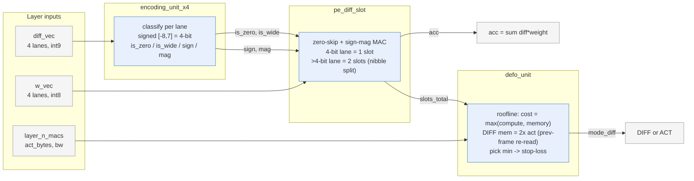
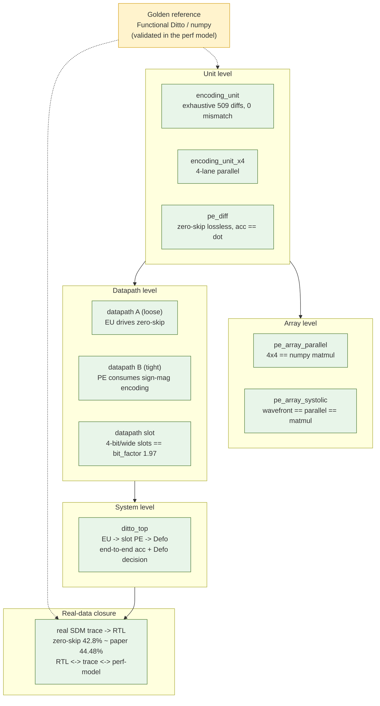

# Ditto RTL — Architecture & Verification Diagrams

## 1. Full compute path (`ditto_top.v`): the three core blocks integrated

The Encoding Unit classifies each temporal-difference element, the slot PE does the
zero-skipped 4-bit/wide MAC and counts multiplier slots, and Defo uses that real slot
count plus the layer's memory traffic to choose DIFF vs ACT. One consistent definition
threads through: EU's `is_wide` selects the PE's 1-slot/2-slot multiply, and the PE's
`slots_total` is exactly the diff-mode compute cost Defo reasons about.

Verified end to end (`test_ditto_top.py`): `acc` equals the numpy dot product of the
real differences; `slots_total` gives bit_factor 1.97; Defo picks DIFF on a
compute-bound layer and stop-losses to ACT on a memory-bound one — all through the same
hardware.

## 2. Verification hierarchy — every level checked against a golden reference

The RTL track reuses the validated Functional Ditto / numpy as the golden reference at
each level, from a single combinational unit up to the integrated path and the array.

All targets pass under cocotb + Icarus Verilog: `cd rtl && make` then one of
`encoding_unit` (default), `x4`, `pe`, `pipe`, `csa`, `datapath`, `datapath_b`,
`datapath_slot`, `defo`, `diffgen`, `vpu`, `array`, `array_sys`, `top`, `real_sdm`.
